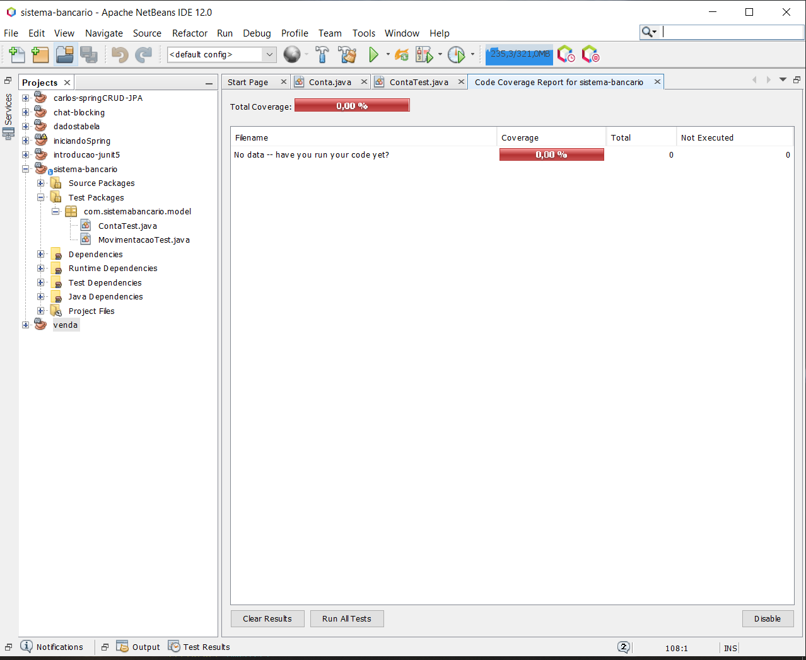

# Sistema Bancário aplicando TDD 

Apesar de todos os testes eu não sei o porquê do resultado de cobertura ter dado 0% sendo que eu fiz todos os testes da aula e procurei em incontáveis fóruns. Enfim este é o print do resultado. 
## Feito por Carlos Eduardo Amorim
